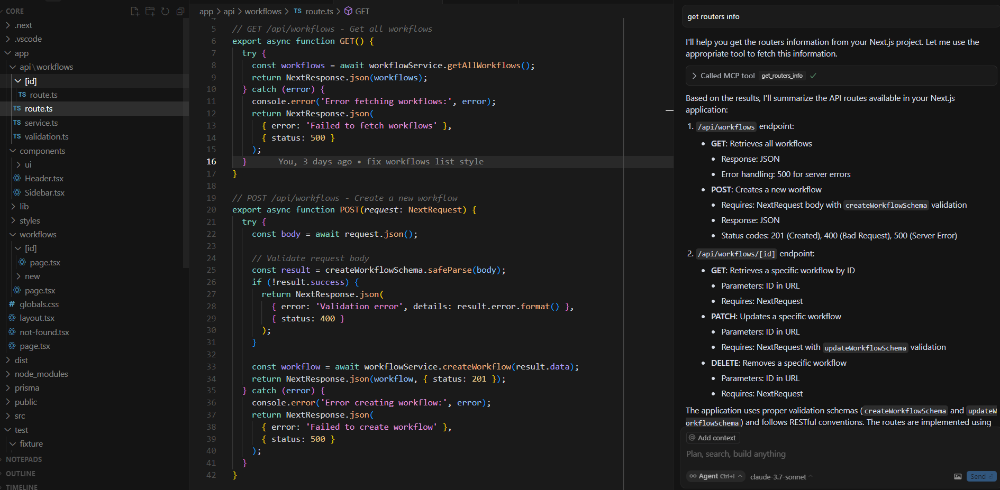

# Next.js MCP Server

## Demo



## Features

- `get-routers-info`

  The Router Analyzer scans your Next.js app directory structure and extracts information about all API routes, including:

  - API paths
  - HTTP methods (GET, POST, PUT, DELETE, etc.)
  - Request parameters
  - Status codes
  - Request and response schemas

## Installation

```bash
npm install next-mcp-server
```

Or if you're using pnpm:

```bash
pnpm add next-mcp-server
```

## Usage

### Command Line

You can run the mcp server directly:

```bash
npm run build
node dist/index.js
```

### Docker

```bash
docker build -t mcp/next -f Dockerfile .
docker run mcp/next -d
```

For cursor usage, define a `mcp.json` under `~/.cursor` or `[projectDir]/.cursor`

```
{
  "mcpServers": {
    "next.js": {
      "url": "http://localhost:4857/sse"
    }
  }
}
```

The `url` here could vary based on your .env settings within the project.


## Output

The tool generates detailed information about each route:

```javascript
[
  {
    "filePath": "/path/to/your/app/api/test/route.ts",
    "implementationPath": "/path/to/your/app/api/test/route.ts",
    "apiPath": "/api/test",
    "handlers": [
      {
        "method": "GET",
        "path": "/api/test",
        "functionSignature": "export async function GET(request: Request)",
        "description": "Get test data",
        "parameters": [],
        "statusCodes": [200]
      },
      {
        "method": "POST",
        "path": "/api/test",
        "functionSignature": "export async function POST(request: Request)",
        "description": "Create test data",
        "parameters": [],
        "requestBodySchema": "{ name: string }",
        "statusCodes": [201, 400]
      }
    ]
  }
]
```

## Development

To run tests:

```bash
npm run test
```

To run the mcp server locally:

```bash
npm run build
node dist/index.js 
```

To run it from node_modules after `npm i`:

```bash
node node_modules/next-mcp-server/dist/index.js
```

To run the playground:

```bash
pnpm --filter playground dev
```

## How It Works

The tool:

1. Scans your Next.js app directory structure for route files
2. Analyzes each route file to extract HTTP methods, paths, parameters, etc.
3. Extracts documentation from comments
4. Returns a structured representation of all your API routes

## Restrictions

1. Due to the nature of accessing filesystem directory by path, it will not work if hosted over network
2. Only supports Next.js App router projects

## License

MIT
